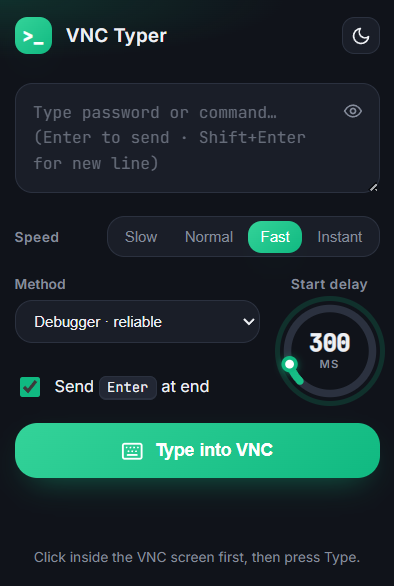

# ⌨ VNC Typer

**Type passwords & commands into web VNC where clipboard paste is blocked — real keystrokes**  
**تایپ پسورد و کامند داخل وب‌وی‌ان‌سی جایی که paste کار نمی‌کند — با کیبورد واقعی**

[English](#english) | [فارسی](#فارسی)

---

---

## English

### 📖 Description

**VNC Typer** is a Chrome extension that **types** text into canvas-based web VNC clients (noVNC, Guacamole, Proxmox / oVirt consoles…) where you can't paste. It converts your text into real keyboard events, character by character, so passwords and commands land exactly as typed.

**Key Features:**
- ⌨️ **Real keystrokes** — character-by-character, works where paste is disabled
- 🧩 **Two engines** — *Synthetic* (default, no banner) or *Debugger* (trusted DevTools events)
- 🎚️ **Speed control** — Slow / Normal / Fast / Instant for slow or laggy servers
- ⏱️ **Rotary delay dial** — animated countdown so you can focus the VNC first
- 🔒 **Password-safe** — masked input (eye toggle), text is never stored
- ↵ **Enter to send** — `Shift+Enter` for a new line, optional Enter at the end to run
- 🌗 **Light & dark theme** with clean Inter + JetBrains Mono typography

---

### 🚀 Installation

1. [Download the repository](https://github.com/phoseinq/vnc-typer/archive/refs/heads/main.zip) and extract it
2. Open `chrome://extensions/` in Chrome
3. Enable **Developer mode** (top-right toggle)
4. Click **Load unpacked** and select the extracted folder

---

### 📝 How to Use

1. Open your VNC page and **click inside the screen** to focus it.
2. Click the extension icon and type your text — `Enter` sends, `Shift+Enter` adds a line.
3. (Optional) tick **Send Enter at end** to run a command, then hit **Type into VNC**.

---

### ⚙️ Options

| Option | Description |
|---|---|
| **Speed** | Per-key delay: Slow / Normal / Fast / Instant (lower it if characters get dropped) |
| **Start delay** | Rotary dial — countdown before typing starts (default 100 ms) |
| **Method** | `Synthetic` dispatches key events in the page · `Debugger` injects trusted events via DevTools |
| **Send Enter at end** | Presses Enter after the text to run the command |
| **Eye toggle** | Hide / show the text (for passwords) |
| **Theme** | Switch light / dark |

---

### 🔧 How It Works

1. **Focus** — you click the VNC canvas so it receives keys
2. **Map** — each character becomes a proper key event (`key` / `code` / `keyCode` + Shift) for a US layout
3. **Send** — *Synthetic* dispatches `KeyboardEvent`s in the page, or *Debugger* uses the Chrome DevTools protocol for trusted events
4. **Pace** — a small per-key delay keeps slow VNC servers from dropping characters
5. **Run** — an optional Enter at the end executes the command

---

### 📄 License

This project is licensed under the MIT License — see the [LICENSE](LICENSE) file for details.

---

### 🤝 Contributing

Contributions are welcome! Feel free to:
- 🐛 Report bugs
- 💡 Suggest features
- 🔧 Submit pull requests

---

### ⭐ Support

If this project helped you, please consider:
- ⭐ Starring the repository
- 🐛 Reporting issues
- 📢 Sharing with others

---

## فارسی

### 📖 معرفی

**VNC Typer** یک افزونه‌ی کروم است که متن را داخل کلاینت‌های وب‌وی‌ان‌سی کانواس‌محور (noVNC، Guacamole، کنسول Proxmox / oVirt و…) جایی که نمی‌شود paste کرد **تایپ** می‌کند. متن را کاراکتر به کاراکتر به رویدادهای واقعی کیبورد تبدیل می‌کند تا پسورد و کامند دقیقاً همان‌طور که نوشتی وارد شوند.

**امکانات کلیدی:**
- ⌨️ **کیبورد واقعی** — کاراکتر به کاراکتر، جایی که paste غیرفعال است هم کار می‌کند
- 🧩 **دو موتور** — *Synthetic* (پیش‌فرض، بدون نوار دیباگ) یا *Debugger* (رویدادهای واقعی DevTools)
- 🎚️ **کنترل سرعت** — Slow / Normal / Fast / Instant برای سرورهای کند
- ⏱️ **دایل چرخشی تاخیر** — شمارش معکوس انیمیشن‌دار تا اول VNC را فوکوس کنی
- 🔒 **امن برای پسورد** — ورودی مخفی (آیکون چشم)، متن هیچ‌وقت ذخیره نمی‌شود
- ↵ **Enter برای ارسال** — `Shift+Enter` خط جدید، و یک Enter انتهایی اختیاری برای اجرا
- 🌗 **تم روشن و تاریک** با تایپوگرافی تمیز Inter و JetBrains Mono

---

### 🚀 نصب

1. [دانلود ریپازیتوری](https://github.com/phoseinq/vnc-typer/archive/refs/heads/main.zip) و اکسترکت کن
2. در کروم آدرس `chrome://extensions/` را باز کن
3. **Developer mode** را از گوشه بالا-راست روشن کن
4. روی **Load unpacked** کلیک کن و پوشه را انتخاب کن

---

### 📝 نحوه استفاده

۱. صفحه‌ی VNC را باز کن و **داخل صفحه کلیک کن** تا فوکوس بگیرد.
۲. روی آیکون افزونه بزن و متن را تایپ کن — `Enter` می‌فرستد، `Shift+Enter` خط جدید می‌زند.
۳. (اختیاری) تیک **Send Enter at end** را بزن تا کامند اجرا شود، بعد **Type into VNC** را بزن.

---

### ⚙️ گزینه‌ها

| گزینه | توضیح |
|---|---|
| **Speed** | تاخیر هر کلید: Slow / Normal / Fast / Instant (اگر کاراکتر جا افتاد کمترش کن) |
| **Start delay** | دایل چرخشی — شمارش معکوس قبل از شروع تایپ (پیش‌فرض ۱۰۰ms) |
| **Method** | `Synthetic` رویدادها را داخل صفحه می‌فرستد · `Debugger` رویدادهای واقعی را با DevTools تزریق می‌کند |
| **Send Enter at end** | بعد از متن یک Enter می‌زند تا کامند اجرا شود |
| **آیکون چشم** | مخفی / نمایش متن (برای پسورد) |
| **Theme** | تغییر تم روشن / تاریک |

---

### 🔧 نحوه کار

۱. **فوکوس** — روی کانواس VNC کلیک می‌کنی تا کلیدها را بگیرد
۲. **نگاشت** — هر کاراکتر به یک رویداد کلید درست (`key` / `code` / `keyCode` + Shift) برای لایوت US تبدیل می‌شود
۳. **ارسال** — *Synthetic* رویدادهای `KeyboardEvent` را داخل صفحه می‌فرستد، یا *Debugger* از پروتکل DevTools برای رویدادهای واقعی استفاده می‌کند
۴. **تنظیم سرعت** — یک تاخیر کوچک بین کلیدها نمی‌گذارد سرورهای کند کاراکتر بیندازند
۵. **اجرا** — یک Enter انتهایی اختیاری کامند را اجرا می‌کند

---

### 📄 مجوز

این پروژه تحت مجوز MIT منتشر شده — فایل [LICENSE](LICENSE) را ببین.

---

### 🤝 مشارکت

مشارکت‌ها خوش‌آمدند! می‌توانی:
- 🐛 باگ گزارش کنی
- 💡 ایده پیشنهاد بدهی
- 🔧 پول ریکوئست بفرستی

---

### ⭐ حمایت

اگر این پروژه بهت کمک کرد، لطفاً:
- ⭐ به ریپازیتوری ستاره بده
- 🐛 مشکلات را گزارش کن
- 📢 با دیگران به اشتراک بگذار

---

**Made with ❤️ for sysadmins stuck on a VNC console**

[Report Bug](https://github.com/phoseinq/vnc-typer/issues) · [Request Feature](https://github.com/phoseinq/vnc-typer/issues)

